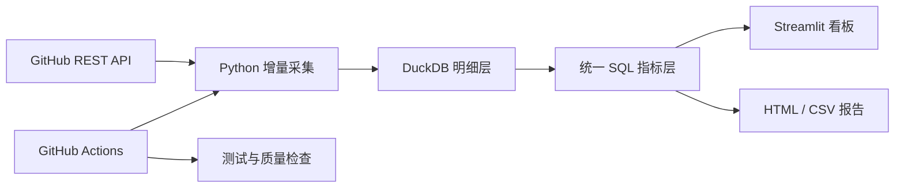

# RepoPulse

[](https://github.com/MeaFew/RepoPulse/actions/workflows/ci.yml)
[](https://www.python.org/)
[](LICENSE)
[](https://repopulse-c7wefwy6hywnphnavs8rme.streamlit.app/)

> 面向开源维护者的 GitHub 仓库健康度、维护效率与贡献者分析工具。

RepoPulse 通过 GitHub REST API 增量采集 Issue、Pull Request、Commit、Release 等公开活动，将明细数据写入 DuckDB，并用统一 SQL 指标驱动 Streamlit 交互式看板。它关注的不只是图表，还包括可解释的指标口径、数据质量、自动化采集和可复现交付。

[在线体验](https://repopulse-c7wefwy6hywnphnavs8rme.streamlit.app/) · [快速开始](#快速开始) · [指标字典](docs/metric_dictionary.md) · [架构说明](docs/architecture.md) · [部署指南](docs/deployment.md) · [更新日志](CHANGELOG.md)

> [!NOTE]
> 在线 Demo 是安全只读模式，默认展示每日更新的 `duckdb/duckdb`、`pola-rs/polars` 和 `sqlglot/sqlglot` 真实仓库快照，不支持访客临时采集任意仓库。若快照不可用，页面会明确标注并回退到模拟数据。Streamlit Community Cloud 长时间无人访问时会休眠，首次打开可能需要手动唤醒并等待片刻。


## 核心能力

| 能力 | 可以回答的问题 |
| --- | --- |
| 活跃度趋势 | Issue、PR、Commit 和 Release 活跃度如何变化？ |
| 维护效率 | 首次响应、首次 Review、关闭与合并耗时的 P50/P90 是多少？ |
| 社区健康 | 新贡献者留存如何？项目是否依赖少数核心贡献者？ |
| 风险诊断 | 30/90 天积压、无响应 Issue、未合并 PR 等风险是否在上升？ |
| 横向对比 | 多个同类仓库中，谁的响应更快、积压更少、贡献更分散？ |
| 报告导出 | 一键生成包含主要发现、风险与建议的 HTML/CSV 报告。 |
| 数据可信度 | 当前数据是否新鲜、达到分页上限、覆盖完整历史？ |
| 维护者待办 | 哪些陈旧 Issue、无人响应项和等待 Review 的 PR 应优先处理？ |

所有核心指标支持 30/90/180 天和自定义日期范围联动筛选。

## 快速开始

需要 Python 3.11 或更高版本。

```bash
git clone https://github.com/MeaFew/RepoPulse.git
cd RepoPulse
python -m venv .venv
```

激活虚拟环境：

```powershell
# Windows PowerShell
.venv\Scripts\Activate.ps1
```

```bash
# macOS / Linux
source .venv/bin/activate
```

安装并加载无需网络的确定性示例数据：

```bash
python -m pip install -e .
repopulse demo
python -m streamlit run app.py
```

浏览器访问 `http://localhost:8501`。

### 分析真实仓库

公开仓库可以匿名采集；建议配置 `GITHUB_TOKEN`，以获得更高的 GitHub API 限额。

```powershell
# Windows PowerShell
$env:GITHUB_TOKEN="your_token"
repopulse collect duckdb/duckdb --max-pages 10
repopulse summary duckdb/duckdb
```

```bash
# macOS / Linux
export GITHUB_TOKEN="your_token"
repopulse collect duckdb/duckdb --max-pages 10
repopulse summary duckdb/duckdb
```

Token 只通过请求头发送给 GitHub，不会写入数据库或应用日志。`--max-pages` 用于限制单次采集成本；对大型仓库，首次运行可能只覆盖最近的数据。

## Docker

```bash
cp .env.example .env
docker compose up --build
```

Windows PowerShell 可使用 `Copy-Item .env.example .env`。Docker Compose 会从 `.env` 读取默认仓库、最大采集页数、演示模式和 GitHub Token；容器内数据库固定保存在命名 volume 中。`.env` 里的数据库路径供本地运行使用。

应用启动后访问 `http://localhost:8501`。停止服务使用 `docker compose down`；除非明确要删除已有分析数据，不要附加 `-v`。

## 工作原理



核心模块保持清晰分层：

```text
github_client.py  HTTP、分页、限流与 GitHub API 语义
storage.py        表结构、自然键和 DuckDB 持久化
pipeline.py       增量采集编排与运行审计
metrics.py        可解释、可测试的统一 SQL 指标
report.py         HTML/CSV 分析报告生成
app.py            Streamlit 交互与展示
```

详细设计见[架构说明](docs/architecture.md)。

## 指标口径亮点

- GitHub Issues 接口返回的 PR 会在采集阶段剔除，避免 Issue 重复计数。
- 所有明细按自然键幂等更新，重复运行不会重复累加同一记录。
- 增量采集保留 5 分钟重叠窗口，降低相同时间戳与轻微时钟偏差造成的漏数风险。
- P50/P90 直接在 DuckDB 中计算，命令行、测试、报告和页面共用同一套逻辑。
- 首次响应与首次 Review 排除作者自评和 Bot；无响应记录单独统计，不使用 0 拉低分布。
- PR Review 只回灌最近 180 天内创建的 PR，在数据完整度与 API 成本之间保持可控权衡。
- 风险提示是透明的规则诊断，不被包装成因果结论或不透明的“健康分”。

完整定义、分子分母和适用边界见[指标字典](docs/metric_dictionary.md)。

## 数据表

| 表 | 内容 |
| --- | --- |
| `repositories` | 仓库快照 |
| `issues` / `issue_comments` | Issue 明细与评论事件 |
| `pull_requests` / `pr_reviews` | PR 明细与 Review 事件 |
| `commits` / `releases` | Commit 与 Release 明细 |
| `pipeline_runs` | 采集运行记录 |

## 在线部署

仓库包含每日运行的 `Refresh analytics snapshot` 工作流。它默认采集一组可对比的数据工程项目，将合并后的 DuckDB 快照提交到 `data/snapshot/repopulse.duckdb`，供在线 Demo 只读加载。

Streamlit Community Cloud 的 Secrets、快照刷新和本地验证步骤见[部署指南](docs/deployment.md)。

## 质量检查

```bash
python -m pip install -e ".[dev]"
ruff check .
pytest --cov=repopulse --cov-report=term-missing
```

自动化流程：

- `CI`：每次 Push 和 Pull Request 执行 Ruff 与 Pytest。
- `Refresh analytics snapshot`：每天以及手动触发时刷新在线 Demo 数据快照。

## 已知边界

- `--max-pages` 会限制首轮历史覆盖范围，不能被理解为“全量数据保证”。
- 180 天以前创建的历史 PR 不回灌 Review，因此其首次 Review 指标不会出现。
- 贡献者留存基于当前已采集窗口估计，窗口前已经活跃的人可能被误判为新贡献者。
- 时间窗口作用于记录的 `created_at`；积压指标以窗口结束日为基准计算老化。
- 指标用于运营诊断；相关性不能直接证明维护行为导致贡献者留存变化。

## Roadmap

- [x] 时间范围筛选与多仓库对比
- [x] 首次响应、首次 Review 与 30/90 天积压指标
- [x] 每日快照刷新与云端只读 Demo
- [x] HTML/CSV 分析报告导出
- [x] 数据覆盖、新鲜度和分页完整性诊断
- [x] 陈旧 Issue、无响应项和等待 Review PR 的维护者待办
- [ ] 新贡献者 PR 漏斗：创建 → Review → 合并
- [ ] 仓库横向对标和语言/规模分层
- [ ] 贡献者 30/90 天留存与生存分析
- [ ] 标签级积压诊断和异常波动提醒

## 参与贡献

欢迎提交指标建议、数据质量案例和可视化改进。开始前请阅读 [CONTRIBUTING.md](CONTRIBUTING.md)。新增指标应说明它服务的决策、分子分母以及可能产生误导的场景。

## License

[MIT](LICENSE)
