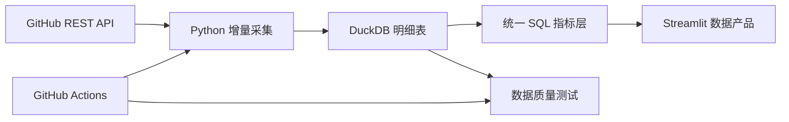

# RepoPulse

> 输入任意 GitHub 仓库，自动分析项目活跃度、维护效率、贡献者留存和社区风险。

RepoPulse 是一个面向开源维护者和数据分析学习者的端到端数据产品。它通过 GitHub REST API 增量采集 Issue、Pull Request、Commit、Release 数据，将原始记录写入 DuckDB，并用统一 SQL 指标驱动 Streamlit 交互式看板。

项目重点不是“画几张图”，而是完整展示：业务问题定义、指标口径、数据采集、分析建模、可视化、质量测试和自动化交付。

## 目前能回答的问题

- 项目的 Issue、PR 和 Commit 活跃度如何变化？
- Issue 关闭时间和 PR 合并时间的中位数、P90 是多少？
- 新贡献者首次贡献后的月度留存表现如何？
- 项目是否依赖少数核心贡献者？
- 开放 Issue 中有多少已经积压超过 90 天？
- 已结束的非草稿 PR 中，有多少最终被合并？

## 架构



核心数据表：

```text
repositories      仓库快照
issues            Issue 明细
pull_requests     PR 明细
commits           Commit 明细
releases          Release 明细
pipeline_runs     采集运行记录
```

完整口径见 [指标字典](docs/metric_dictionary.md)，技术设计见 [架构说明](docs/architecture.md)。

## 快速开始

需要 Python 3.11 或以上版本。

```bash
python -m venv .venv
# Windows PowerShell
.venv\Scripts\Activate.ps1
python -m pip install -e ".[dev]"
```

先加载无需网络的确定性示例数据：

```bash
repopulse demo
streamlit run app.py
```

浏览器访问 `http://localhost:8501`。

采集一个真实仓库：

```bash
repopulse collect duckdb/duckdb --max-pages 10
repopulse summary duckdb/duckdb
```

公开仓库可以匿名访问，但建议设置 `GITHUB_TOKEN` 以获得更高的 API 限额：

```powershell
$env:GITHUB_TOKEN="your_token"
repopulse collect owner/repository
```

Token 只用于请求 GitHub，不会写入数据库。

## Docker

```bash
docker compose up --build
```

数据库保存在 Docker volume 中。也可以复制 `.env.example` 为 `.env`，修改默认仓库和最大采集页数。

## 在线 Demo

项目可以直接部署到 Streamlit Community Cloud：

1. 将仓库推送到 GitHub。
2. 在 `share.streamlit.io` 创建应用。
3. 选择本仓库的 `main` 分支，并将入口文件设置为 `app.py`。
4. 在 Advanced settings 中选择 Python 3.12。
5. 将 `.streamlit/secrets.toml.example` 的内容复制到 Secrets。

云端演示模式会在空数据库中自动生成匿名示例数据，并隐藏真实采集入口，避免公开访客消耗维护者的 GitHub API 额度。依赖安装通过根目录的 `requirements.txt` 完成。

建议的 Secrets：

```toml
REPOPULSE_DEMO_MODE = "true"
REPOPULSE_DB_PATH = "/tmp/repopulse.duckdb"
REPOPULSE_MAX_PAGES = "3"
```

本地验证云端模式：

```powershell
$env:REPOPULSE_DEMO_MODE="true"
$env:REPOPULSE_DB_PATH="$env:TEMP/repopulse-cloud-demo.duckdb"
streamlit run app.py
```

## 数据口径亮点

- GitHub 的 Issues 接口也会返回 PR，采集阶段通过 `pull_request` 字段进行剔除，避免 Issue 重复计数。
- 所有写入以自然键幂等更新；重复运行不会重复累加同一 Issue、PR 或 Commit。
- 增量采集保留 5 分钟重叠窗口，降低相同时间戳或轻微时钟偏差造成的漏数风险。
- P50/P90 直接在 DuckDB 中计算，页面不维护第二套指标逻辑。
- 留存按贡献者首次出现月份分组，同一贡献者同月多次活动只计一次。
- 风险提示是规则诊断，不被包装成因果结论。

## 运行质量检查

```bash
ruff check .
pytest --cov=repopulse --cov-report=term-missing
```

仓库包含两条自动化流程：

- `CI`：每次提交检查代码规范并运行测试。
- `Refresh analytics snapshot`：每周或手动采集目标仓库，将 DuckDB 快照保存为短期构建产物。

## 已知边界

- `--max-pages` 用于控制 API 成本；大型仓库第一次运行可能只覆盖最近的数据，页面会明确提示这一点。
- 当前版本不采集每条评论和 Review 时间线，因此暂不提供“首次响应时间”。该指标将在事件级模型完成后加入。
- 贡献者留存使用当前已采集窗口估计。窗口开始前已经活跃的贡献者可能被误判为新贡献者，这是典型的左截断问题。
- 指标用于运营诊断。相关性分析不能直接证明维护行为导致贡献者留存变化。

## Roadmap

- [ ] Issue/PR Event 事件级模型与首次响应时间
- [ ] 新贡献者 PR 漏斗：创建 → Review → 合并
- [ ] 仓库横向对标和语言/规模分层
- [ ] 贡献者 30/90 天留存与生存分析
- [ ] 标签级积压诊断和异常波动提醒
- [ ] Evidence/Power BI 展示版本

## 参与贡献

欢迎提交指标建议、数据质量案例和可视化改进。开始前请阅读 [CONTRIBUTING.md](CONTRIBUTING.md)。

## License

[MIT](LICENSE)
