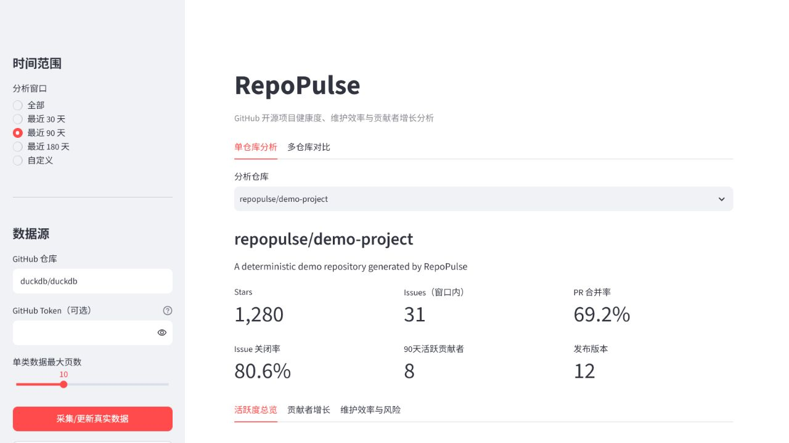
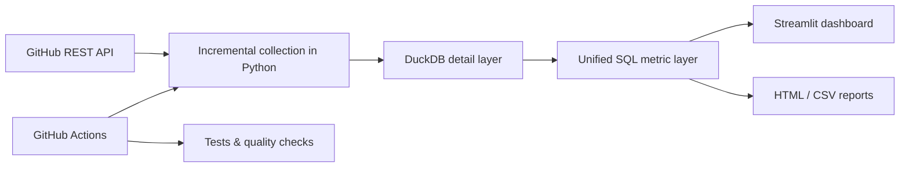

**English** | [中文](README.zh-CN.md)

# RepoPulse

[](https://github.com/MeaFew/RepoPulse/actions/workflows/ci.yml)
[](https://www.python.org/)
[](LICENSE)
[](https://repopulse-c7wefwy6hywnphnavs8rme.streamlit.app/)

> GitHub repository health, maintenance efficiency, and contributor analytics for open-source maintainers.

RepoPulse incrementally collects public activity — issues, pull requests, commits, and releases — through the GitHub REST API, writes the detail records into DuckDB, and drives an interactive Streamlit dashboard from a unified set of SQL metrics. It cares about more than charts: interpretable metric definitions, data quality, automated collection, and reproducible delivery.

[Live Demo](https://repopulse-c7wefwy6hywnphnavs8rme.streamlit.app/) · [Quick Start](#quick-start) · [Metric Dictionary](docs/metric_dictionary.md) · [Architecture](docs/architecture.md) · [Deployment Guide](docs/deployment.md) · [Changelog](CHANGELOG.md)

> [!NOTE]
> The online demo runs in a safe read-only mode. By default it shows daily-refreshed snapshots of the real repositories `duckdb/duckdb`, `pola-rs/polars`, and `tobymao/sqlglot`; visitors cannot collect arbitrary repositories on demand. If a snapshot is unavailable, the page says so explicitly and falls back to mock data. Streamlit Community Cloud hibernates after long periods without traffic, so the first visit may require waking the app and waiting a moment.



## Core Capabilities

| Capability | Questions it answers |
| --- | --- |
| Activity trends | How do issue, PR, commit, and release activity change over time? |
| Maintenance efficiency | What are the P50/P90 of time to first response, first review, close, and merge? |
| Community health | How well are new contributors retained? Does the project depend on a few core contributors? |
| Risk diagnosis | Are 30/90-day backlogs, unanswered issues, and unmerged PRs trending up? |
| Cross-repo comparison | Among similar repositories, which one responds faster, carries less backlog, and spreads contributions wider? |
| Report export | Generate an HTML/CSV report with key findings, risks, and recommendations in one click. |
| Data trustworthiness | Is the current data fresh, hitting pagination limits, and covering the full history? |
| Maintainer to-do | Which stale issues, unanswered items, and PRs awaiting review should be handled first? |

All core metrics support linked filtering by 30/90/180-day and custom date ranges.

## Quick Start

Requires Python 3.11 or later.

```bash
git clone https://github.com/MeaFew/RepoPulse.git
cd RepoPulse
python -m venv .venv
```

Activate the virtual environment:

```powershell
# Windows PowerShell
.venv\Scripts\Activate.ps1
```

```bash
# macOS / Linux
source .venv/bin/activate
```

Install the package and load the deterministic, offline sample data:

```bash
python -m pip install -e .
repopulse demo
python -m streamlit run app.py
```

Open `http://localhost:8501` in your browser.

### Analyzing a Real Repository

Public repositories can be collected anonymously; setting `GITHUB_TOKEN` is recommended for a higher GitHub API rate limit.

```powershell
# Windows PowerShell
$env:GITHUB_TOKEN="your_token"
repopulse collect duckdb/duckdb --max-pages 10
repopulse summary duckdb/duckdb
```

```bash
# macOS / Linux
export GITHUB_TOKEN="your_token"
repopulse collect duckdb/duckdb --max-pages 10
repopulse summary duckdb/duckdb
```

The token is sent to GitHub only in request headers and is never written to the database or application logs. `repopulse collect` still accepts a `--token` argument, but it leaves the secret in your shell history and prints a warning when used, so prefer the `GITHUB_TOKEN` environment variable. `--max-pages` caps the cost of a single collection run; for large repositories, the first run may cover only recent data.

## Docker

```bash
cp .env.example .env
docker compose up --build
```

On Windows PowerShell, use `Copy-Item .env.example .env`. Docker Compose reads the default repository, max collection pages, demo mode, and GitHub token from `.env`; inside the container the database always lives in a named volume. The database path in `.env` is for local runs. The image is built with the dependency versions pinned in `requirements.lock` and runs as the non-root user `appuser`.

Once the app is up, visit `http://localhost:8501`. Stop it with `docker compose down`; do not add `-v` unless you explicitly want to delete existing analytics data.

## How It Works



The core modules stay cleanly layered:

```text
github_client.py  HTTP, pagination, rate limiting, and GitHub API semantics
storage.py        Schema, natural keys, and DuckDB persistence
pipeline.py       Incremental collection orchestration and run auditing
metrics.py        Interpretable, testable, unified SQL metrics
report.py         HTML/CSV analytics report generation
app.py            Streamlit interaction and presentation
```

See the [architecture doc](docs/architecture.md) for the detailed design.

## Metric Definition Highlights

- PRs returned by the GitHub Issues API are filtered out during collection, avoiding double-counted issues.
- Every detail record is idempotently upserted by natural key, so reruns never accumulate duplicates.
- Incremental collection keeps a 5-minute overlap window to reduce misses caused by identical timestamps and minor clock skew.
- P50/P90 are computed directly in DuckDB; the CLI, tests, reports, and dashboard all share the same logic.
- First response and first review exclude author self-comments and bots; unanswered records are counted separately instead of dragging the distribution down with zeros.
- PR reviews are backfilled only for PRs created within the last 180 days — a controlled trade-off between data completeness and API cost.
- Risk signals are transparent, rule-based diagnostics, not packaged as causal conclusions or an opaque "health score".

Full definitions, numerators and denominators, and applicability boundaries are in the [metric dictionary](docs/metric_dictionary.md).

## Data Tables

| Table | Contents |
| --- | --- |
| `repositories` | Repository snapshots |
| `issues` / `issue_comments` | Issue details and comment events |
| `pull_requests` / `pr_reviews` | PR details and review events |
| `commits` / `releases` | Commit and release details |
| `pipeline_runs` | Collection run records |

## Online Deployment

The repository ships with a daily `Refresh analytics snapshot` workflow. By default it collects a set of comparable data-engineering projects and commits the merged DuckDB snapshot to `data/snapshot/repopulse.duckdb`, which the online demo loads read-only.

Streamlit Community Cloud secrets, snapshot refresh, and local verification steps are covered in the [deployment guide](docs/deployment.md).

## Quality Checks

```bash
python -m pip install -e ".[dev]"
ruff check .
pytest --cov=repopulse --cov-report=term-missing
```

Dependency versions are pinned by lock files: `requirements.lock` holds the runtime dependencies (used by the Docker image), `requirements-dev.lock` additionally includes development dependencies (used by CI), and both are generated by uv. Regenerate them after upgrading dependencies:

```bash
uv pip compile pyproject.toml --python-version 3.12 -o requirements.lock
uv pip compile pyproject.toml --extra dev --python-version 3.12 -o requirements-dev.lock
```

`requirements.txt` is kept for Streamlit Community Cloud to install runtime dependencies.

Automation:

- `CI`: runs Ruff and Pytest on every push and pull request.
- `Refresh analytics snapshot`: refreshes the online demo's data snapshot daily and on manual dispatch.

## Known Boundaries

- `--max-pages` limits first-run historical coverage and must not be read as a "full data guarantee".
- Reviews are not backfilled for PRs created more than 180 days ago, so their first-review metrics never appear.
- Contributor retention is estimated from the currently collected window; people already active before the window may be misclassified as new contributors.
- The time window applies to each record's `created_at`; backlog metrics measure aging against the window's end date.
- Metrics are for operational diagnosis; correlation alone cannot prove that maintenance behavior caused changes in contributor retention.

## Roadmap

- [x] Time-range filtering and multi-repository comparison
- [x] First response, first review, and 30/90-day backlog metrics
- [x] Daily snapshot refresh and a cloud-hosted read-only demo
- [x] HTML/CSV analytics report export
- [x] Data coverage, freshness, and pagination-completeness diagnostics
- [x] Maintainer to-do for stale issues, unanswered items, and PRs awaiting review
- [ ] New-contributor PR funnel: create → review → merge
- [ ] Cross-repository benchmarking with language/size stratification
- [ ] Contributor 30/90-day retention and survival analysis
- [ ] Label-level backlog diagnosis and anomaly alerts

## Contributing

Metric proposals, data-quality cases, and visualization improvements are all welcome. Please read [CONTRIBUTING.md](CONTRIBUTING.md) before you start. A new metric should state the decision it serves, its numerator and denominator, and the scenarios where it could mislead.

## License

[MIT](LICENSE)
